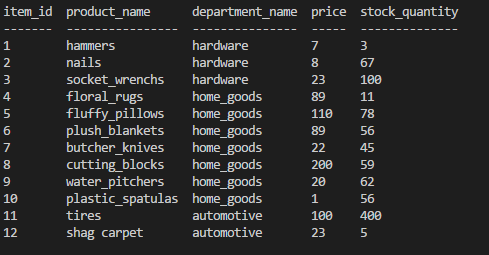
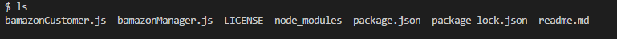
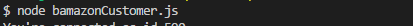
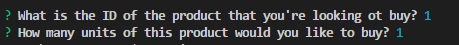
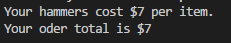
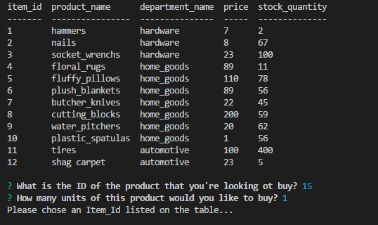
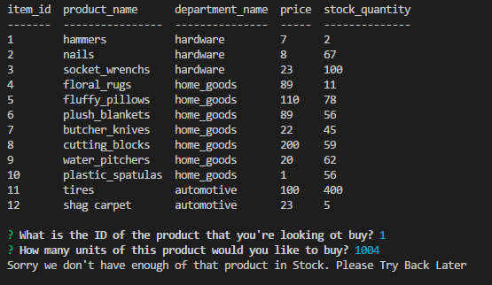
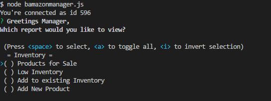
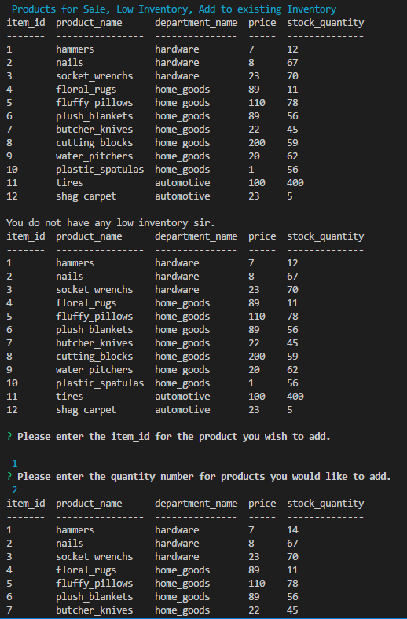

# Bamazon    
 This app uses a Node.js CLI   to access manage inventory
 for inventory, and managerial functions. The data
 is stored on a MySQL database. 

## Problem solved
1. Ability to managed inventory that is sold.
2. Replenish inventory as it exits database.
3. Create multiple MVC for different users. 

## Deployed Site

# Tools
- Node.js
- Mysql
- GitHub
- Nodemon.js
- Inquirer.js
- DocToc (Table of Contents)

<!-- START doctoc generated TOC please keep comment here to allow auto update -->
<!-- DON'T EDIT THIS SECTION, INSTEAD RE-RUN doctoc TO UPDATE -->
**Table of Contents**  *generated with [DocToc](https://github.com/thlorenz/doctoc)*

- [Backend](#Backend)
 - [Node.js](https://nodejs.org/en/)
 - [MySQL](https://www.mysql.com/)
 - [Inquirer](https://www.npmjs.com/package/inquirer)
 
- [Development Tools](#development-tools)
  - [Heroku](https://www.heroku.com/)
  - [GitHub](https://github.com/JasonRobnson)
  - [DocToc](https://github.com/thlorenz/doctoc)

<!-- END doctoc generated TOC please keep comment here to allow auto update -->
## Installation

Instructions on how to install the app locally.

npm i inquirer
npm i mysql
npm i console.table
## Testing

What tech is used for testing.

`How to run the tests`

### BamazonCustomer.js

A view of the listed files within the folder:

Here is how to start the node apps:

A snapshot of the initial inventory:

This is how the app query's the user. The 1's are simply examples of selections:

This is how the app handles checkout and pricing:

### Validation Handling

This is an example of how the app handles ItemId validations:

This is an example of how the app handles Quantity validations:

## BamazonManager

This is an example of the BamazonManager app working:

This is an example of the BamazonManager app working:

